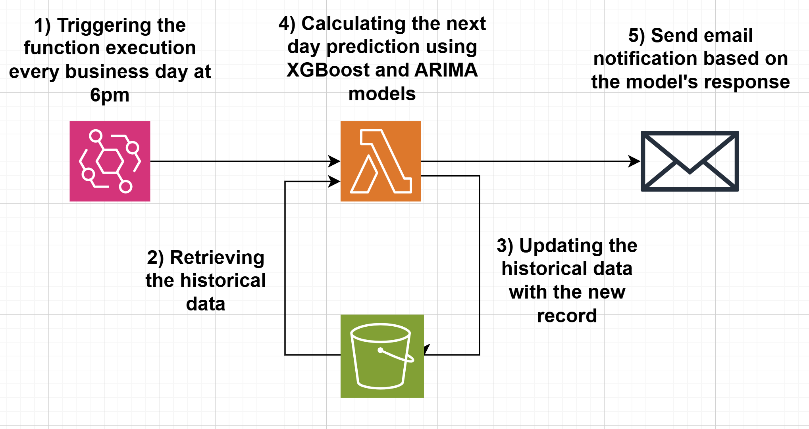

<h2>Table of Contents</h2>
<ul>
  <li><a href="#overview">Overview</a></li>
  <li><a href="#repository-structure">Repository Structure</a></li>
  <li><a href="#features">Features</a></li>
  <li><a href="#prerequisites">Prerequisites</a></li>
  <li><a href="#setup-instructions">Setup Instructions</a></li>
  <li><a href="#how-it-works">How It Works</a></li>
  <li><a href="#dependencies">Dependencies</a></li>
  <li><a href="#licence">Licence</a></li>
  <li><a href="#acknowledgements">Acknowledgements</a></li>
</ul>

<h1>Algorithmic trading notification system</h1> 

<h2>Overview</h2>

This project implements an automated trading signal generator for the Southern Company (SO) stock. Every business day, the system:
- Retrieves the latest market data from the Alpha Vantage API.
- Fetches historical data stored in an Amazon S3 bucket.
- Processes and enriches the data by computing technical indicators (e.g., moving averages, cyclic date features) and forecasting next-day prices using an ARIMA model.
- Generates a trading recommendation using an XGBoost model to predict whether the stock price will increase or decrease.
- Sends an email notification with the prediction probability and a corresponding BUY/SELL recommendation.

The Lambda function is containerized using Docker and triggered by AWS EventBridge on a scheduled basis.

                              

<h2>Repository structure</h2>
- lambda.py:        Main Lambda handler function
- functions.py:     Utility functions for data retrieval, processing, modeling, and notifications
- requirements.txt: Python dependencies
- Dockerfile:       Docker configuration for building the Lambda container image</code></pre>

<h2>Features</h2> 
- Data Acquisition: Retrieves current market data using the Alpha Vantage API.
- Data Persistence: Reads and writes historical data to an S3 bucket.
- Data Processing & Feature Engineering: Computes moving averages, applies logarithmic transformations, generates cyclical sine/cosine features, and creates feature interactions.
- Forecasting: Uses an ARIMA model to predict next-day stock prices.
- Machine Learning Prediction: Applies an XGBoost model to determine the probability of a price increase or decrease.
- Notifications: Sends email alerts with trading recommendations based on prediction probabilities.
- Containerized Deployment: Packaged as a Docker image for seamless deployment as an AWS Lambda function.

<h2>Prerequisites</h2> 
- AWS Account: For Lambda, S3, and EventBridge.
- Docker: Installed locally for building the container image.
- AWS CLI: Configured for deploying the container image to AWS Lambda.
- S3 Bucket: An S3 bucket (default: algtradingbucket) to store historical CSV data.
- Alpha Vantage API Key: Replace the default key in functions.py if necessary.
- Email Credentials: Valid SMTP credentials for sending email notifications (configured in the send_email function).

<h2>Setup Instructions</h2>
<h3>1) Clone the Repository</h3>
<pre><code>git clone https://github.com/yourusername/algorithmic-trading-notification.git
cd algorithmic-trading-notification</code></pre>

<h3>2) Configure the Environment</h3>
- Obtain an Alpha Vantage API key. This will be used to fetch their historical stock data.
- Email Notifications: Create a default sender email, a password, and a receiver email in the send_email function. For more information, search for Google's App Password.
- S3 Bucket: Ensure the bucket name and object key in get_s3_data() and store_s3_data() match your AWS configuration.
- Historical Data Initialization: I recommend extracting all available data from the Alpha Vantage API to create the initial Historical Data CSV file. This will provide the XGBoost model with more training data.
- Install Dependencies Locally: <code>pip install -r requirements.txt</code>.
- Build the Docker Image: <code>docker build -t algtrading-lambda .</code>
- Deploy to AWS Lambda:
  <ul>
    <li>Push the Image to ECR: Follow AWS documentation to push your Docker image to Amazon ECR.</li>
    <li>Create/Update a Lambda Function: Configure your Lambda function to use the container image from ECR.</li>
    <li>Set Up EventBridge: Create an EventBridge rule to trigger your Lambda function every business day.</li>
  </ul>

<h2>How It Works</h2> 
<h3>1) Data Acquisition & Validation:</h3> 
- The Lambda handler (lambda_handler in lambda.py) is triggered.
- Current day records are fetched via get_current_day_records().
- Historical data is retrieved from S3 using get_s3_data().
- A check is performed to avoid duplicate records.

<h3>2) Data Processing & Feature Engineering:</h3> 
- The new data is concatenated with the historical DataFrame.
- Technical indicators (e.g., moving averages) and cyclical features are computed.
- An ARIMA model forecasts the next day's closing price, and the forecast is appended as a new feature.
- A target value is set for the previous day based on the closing price movement.

<h3>3) Model Prediction:</h3>
- Features and target values are prepared using <code>calculate_X_y_row_to_predict()</code>.
- An XGBoost model is trained to predict the price movement probability.
- The prediction probability is calculated with <code>calculate_prediction_probability()</code>.

<h3>4) Notification & Persistence:</h3> 
- An email is sent with the trading recommendation based on the prediction probability.
- The updated DataFrame is stored back to S3 for future reference.

<h2>Dependencies</h2> 
- Python 3.9
- pandas
- requests
- boto3
- xgboost
- statsmodels
- numpy
- smtplib

<h2>Licence</h2> 
This project is licensed under the MIT License.

<h2>Acknowledgements</h2> 
- Alpha Vantage: For providing reliable stock market data.
- AWS: For their robust cloud services including Lambda, S3, and EventBridge.
- Open-Source Contributors: For the development and maintenance of libraries like Pandas, NumPy, XGBoost, and Statsmodels.
