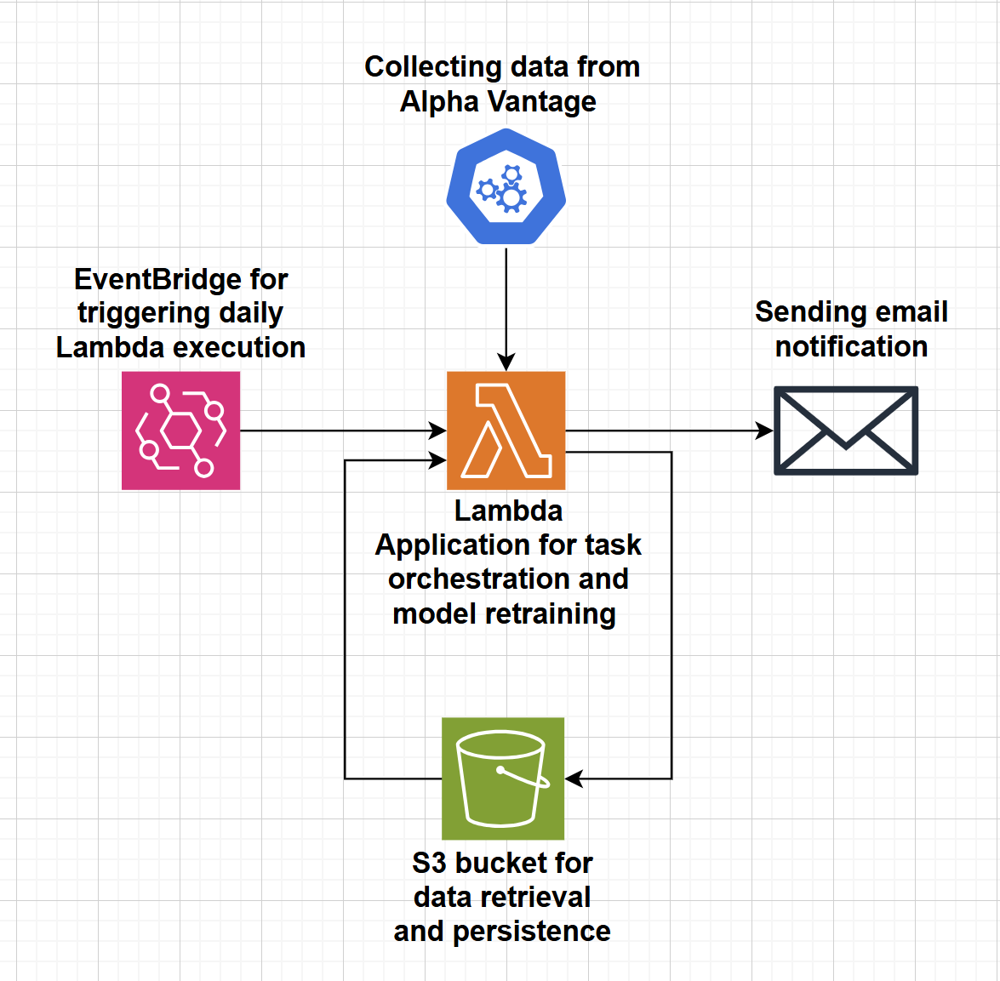

<h2>Table of Contents</h2>
<ul>
  <li><a href="#overview">Overview</a></li>
  <li><a href="#repository-structure">Repository Structure</a></li>
  <li><a href="#features">Features</a></li>
  <li><a href="#how-it-works">How It Works</a></li>
  <li><a href="#dependencies">Dependencies</a></li>
  <li><a href="#licence">Licence</a></li>
  <li><a href="#acknowledgements">Acknowledgements</a></li>
</ul>

<h1>Algorithmic trading notification system</h1> 

<h2>Overview</h2>

This project implements an automated trading signal generator for the Southern Company (SO) stock. Every business day, the system computes the probability that the stock value will increase or decrease the next day and sends an appropriate email notification with the response.

The Lambda function is containerized using Docker and triggered by AWS EventBridge on a scheduled basis.

 

<h2>Repository Structure</h2>
<ul>
  <li><strong>lambda.py:</strong> Main Lambda handler function.</li>
  <li><strong>functions.py:</strong> Utility functions for data retrieval, processing, modeling, and notifications.</li>
  <li><strong>requirements.txt:</strong> Python dependencies.</li>
  <li><strong>Dockerfile:</strong> Docker configuration for building the Lambda container image.</li>
</ul>

<h2>Implementation details</h2>
<ul>
  <li><strong>Data Acquisition:</strong> Retrieves current market data using the Alpha Vantage API.</li>
  <li><strong>Data Persistence:</strong> Reads and writes historical data to an S3 bucket.</li>
  <li><strong>Data Processing & Feature Engineering:</strong> Computes moving averages, applies logarithmic transformations, generates cyclical sine/cosine features, and creates feature interactions.</li>
  <li><strong>Forecasting:</strong> Uses an ARIMA model to predict next-day stock prices.</li>
  <li><strong>Machine Learning Prediction:</strong> Applies an XGBoost model to determine the probability of a price increase or decrease.</li>
  <li><strong>Notifications:</strong> Sends email alerts with trading recommendations based on prediction probabilities.</li>
  <li><strong>Containerized Deployment:</strong> Packaged as a Docker image for seamless deployment as an AWS Lambda function.</li>
</ul>
 
<h2>How It Works</h2>
<h3>1) Data Acquisition & Validation</h3>
<ul>
  <li>The Lambda handler (<code>lambda_handler</code> in <code>lambda.py</code>) is triggered.</li>
  <li>Current day records are fetched via <code>get_current_day_records()</code>.</li>
  <li>Historical data is retrieved from S3 using <code>get_s3_data()</code>.</li>
  <li>A check is performed to avoid duplicate records.</li>
</ul>

<h3>2) Data Processing & Feature Engineering</h3>
<ul>
  <li>The new data is concatenated with the historical DataFrame.</li>
  <li>Technical indicators (e.g., moving averages) and cyclical features are computed.</li>
  <li>An ARIMA model forecasts the next day's closing price, and the forecast is appended as a new feature.</li>
  <li>A target value is set for the previous day based on the closing price movement.</li>
</ul>

<h3>3) Model Prediction</h3>
<ul>
  <li>Features and target values are prepared using <code>calculate_X_y_row_to_predict()</code>.</li>
  <li>An XGBoost model is trained to predict the price movement probability.</li>
  <li>The prediction probability is calculated with <code>calculate_prediction_probability()</code>.</li>
</ul>

<h3>4) Notification & Persistence</h3>
<ul>
  <li>An email is sent with the trading recommendation based on the prediction probability.</li>
  <li>The updated DataFrame is stored back to S3 for future reference.</li>
</ul>

<h2>Dependencies</h2>
<ul>
  <li>Python 3.9</li>
  <li>pandas</li>
  <li>requests</li>
  <li>boto3</li>
  <li>xgboost</li>
  <li>statsmodels</li>
  <li>numpy</li>
  <li>smtplib</li>
</ul>

<h2>Licence</h2>

This project is licensed under the MIT License.

<h2>Acknowledgements</h2>
<ul>
  <li>Alpha Vantage: For providing reliable stock market data.</li>
  <li>AWS: For their robust cloud services including Lambda, S3, and EventBridge.</li>
  <li>Open-Source Contributors: For the development and maintenance of libraries like Pandas, NumPy, XGBoost, and Statsmodels.</li>
</ul>
